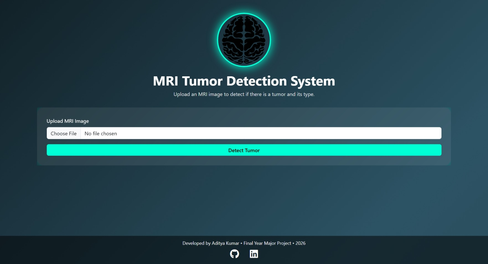
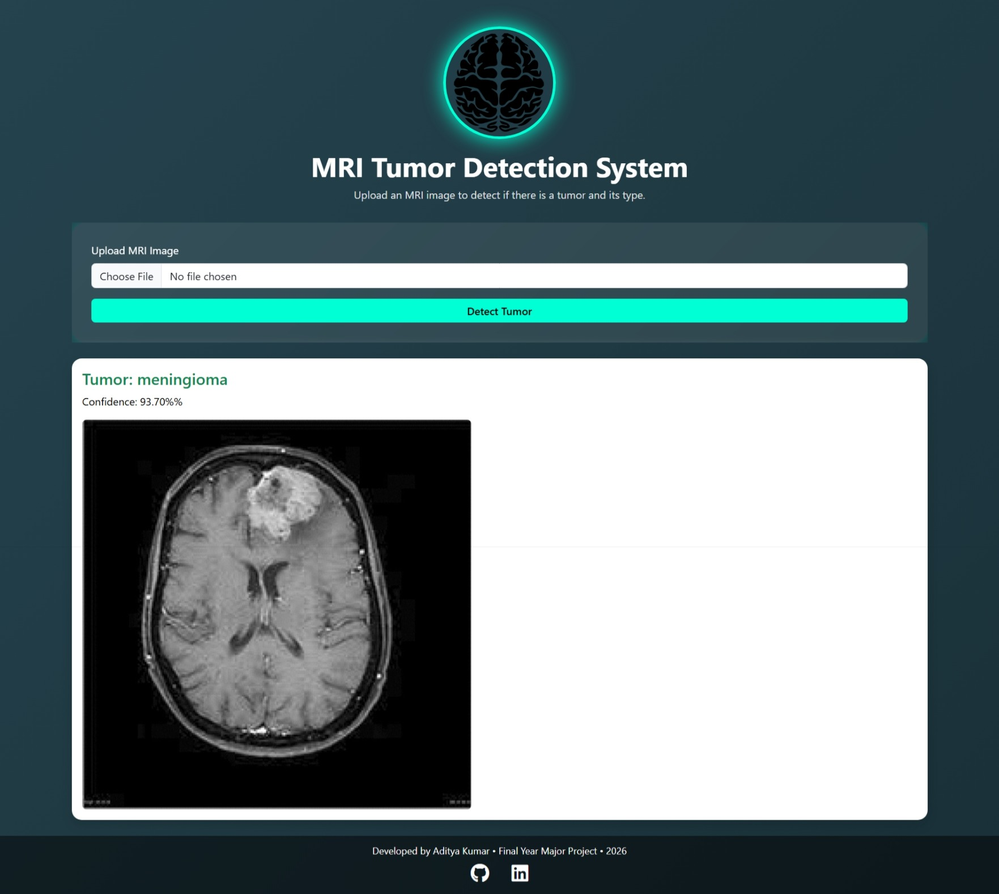

<p align="center">
  <h1 align="center">🧠 Brain Tumor Detection Web Application</h1>
  <p align="center">
    Deep Learning Based MRI Classification System
  </p>
</p>

<p align="center">
  
  
  
  
</p>

---

## 📌 Project Overview

This project is a deep learning-powered web application that classifies brain MRI images into tumor categories using a Convolutional Neural Network (CNN).

The system enables users to upload MRI scans and receive:

- 🧠 Tumor Type Prediction  
- 📊 Confidence Score  
- ⚡ Fast Web-Based Inference  

---

## 🎯 Classification Categories

- Glioma Tumor  
- Meningioma Tumor  
- Pituitary Tumor  
- No Tumor  

---

## 🏗 Tech Stack

### 🔹 Backend
- Python 3.10  
- Flask  
- Gunicorn  
- TensorFlow (Keras API)  
- NumPy  
- h5py  
- Pillow  

### 🔹 Frontend
- HTML5  
- CSS3  
- Bootstrap  
- Jinja2  

### 🔹 Deployment
- Render  
- GitHub  

---

## 🧠 Model Details

- Architecture: Convolutional Neural Network (CNN)  
- Framework: TensorFlow / Keras  
- Model Format: `.h5`  
- Input Size: 128x128 pixels  
- Normalization: Pixel values scaled to 0–1  
- Output Layer: Softmax Activation  
- Prediction Logic: `argmax()` classification  

---

## 📂 Project Structure

```
Brain-Tumor-Detection/
│
├── main.py
├── requirements.txt
├── runtime.txt
├── models/
│   └── model.h5
├── templates/
│   └── index.html
├── static/
├── uploads/
└── README.md
```

---

## ⚙️ Installation Guide

### 1️⃣ Clone Repository

```
git clone https://github.com/adityayadav8294/Brain-Tumor-Detection.git
cd Brain-Tumor-Detection
```

### 2️⃣ Create Virtual Environment

```
python -m venv venv
venv\Scripts\activate
```

### 3️⃣ Install Dependencies

```
pip install -r requirements.txt
```

### 4️⃣ Run Application

```
python main.py
```

Application runs on:

```
http://127.0.0.1:5000/
```

---

## 🌐 Production Deployment

Configured using:

```
gunicorn main:app --workers 1 --threads 1 --timeout 300
```

---


## 📊 Model Performance

The trained CNN model achieved the following accuracy:

- Glioma: 99-100%
- Meningioma: 93-94%
- Pituitary: 98-99%
- No Tumor: 97-98%

Overall Average Accuracy: ~97-98%

---

## 📸 Application Preview

### 🖥 Upload Interface



---

### 🔍 Prediction Output



---

## 🚀 Key Features

- Clean and responsive UI  
- Real-time tumor classification  
- Confidence score display  
- Structured modular architecture  
- Production-ready configuration  

---

## 📈 Future Improvements

- TensorFlow Lite optimization  
- Docker support  
- REST API version  
- Model accuracy improvement  

---

## 👨‍💻 Author

**Aditya Kumar**

🌐 Portfolio: https://aditya82.netlify.app/  
📧 Email: adityasingh829442@gmail.com  

---

<p align="center">
  ⭐ If you found this project useful, consider giving it a star!
</p>